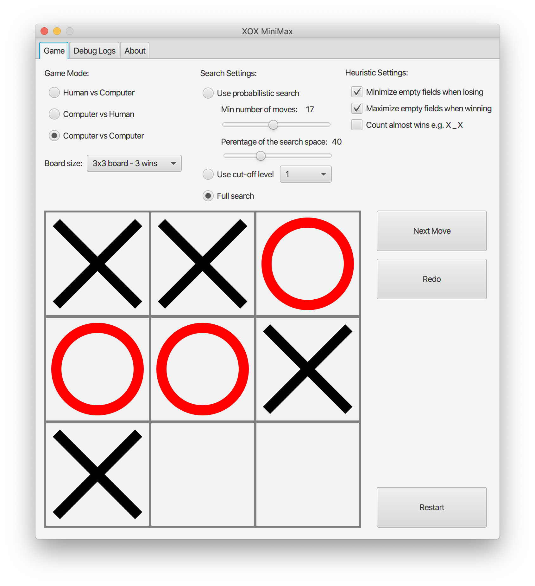
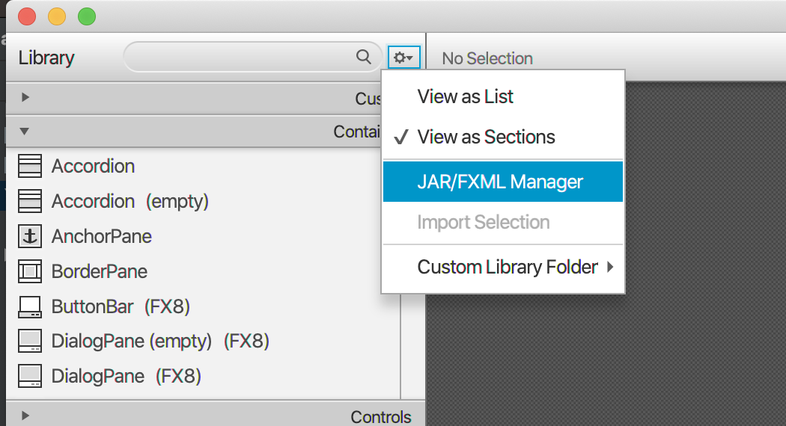
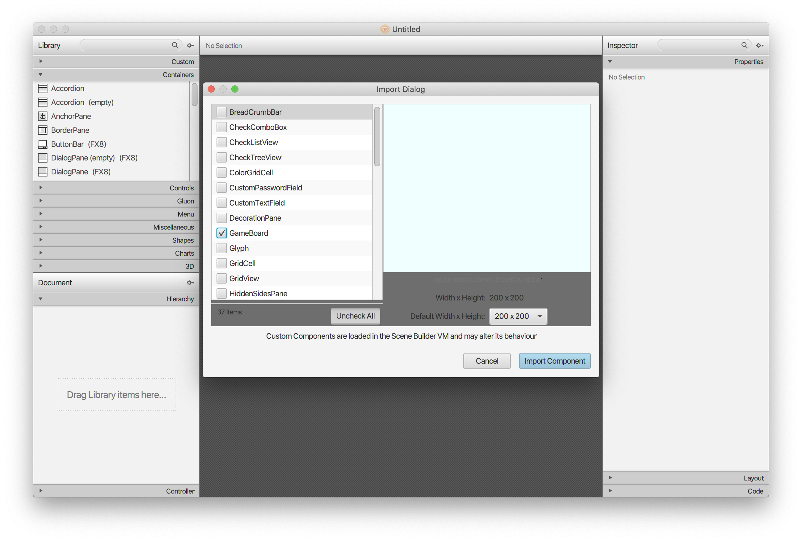
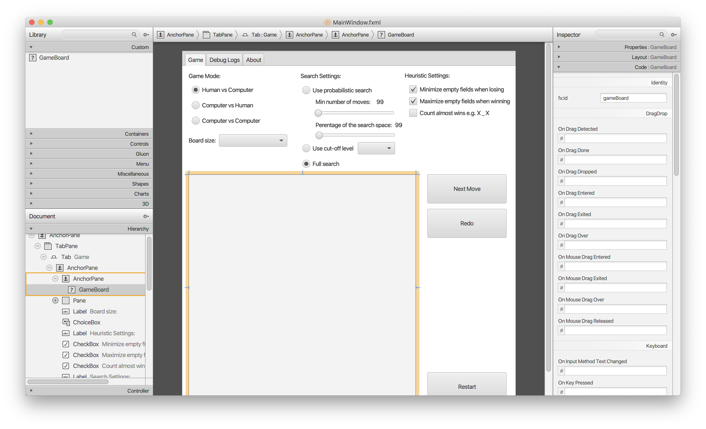

### TicTacToe minimax



To start execute:
```
./mvnw clean install
./mvnw javafx:run -pl gui
```

Application GUI was created using JavaFX.
I tested it on both macOS and Linux.

## Contributors Guide

### SceneBuilder setup

TODO: Upgrade after upgrading to JavaFX 17

I. Create a JAR with `GameBoard` custom control
```
./gradlew jar
```

Make sure that the JAR uses the same Java version as the
one used by SceneBuilder. You can adjust Java version by editing
`build.gradle.kts`:
```kotlin
java {
    sourceCompatibility = JavaVersion.VERSION_11
    targetCompatibility = JavaVersion.VERSION_11
}
```
For example, I had to downgrade my project to v11 from v14 to be
able to import my custom controls.

II. Import JAR into SceneBuilder



Select "Add library from file system" option.
Be default Gradle will create `xox.jar` in
`build/libs/` directory.

Select only `GameBoard` control:


If `GameBoard` does not show up on the list,
you need to tweak Java version settings.

III. Now you should be able to open `MainWindow.fxml` in SceneBuilder

