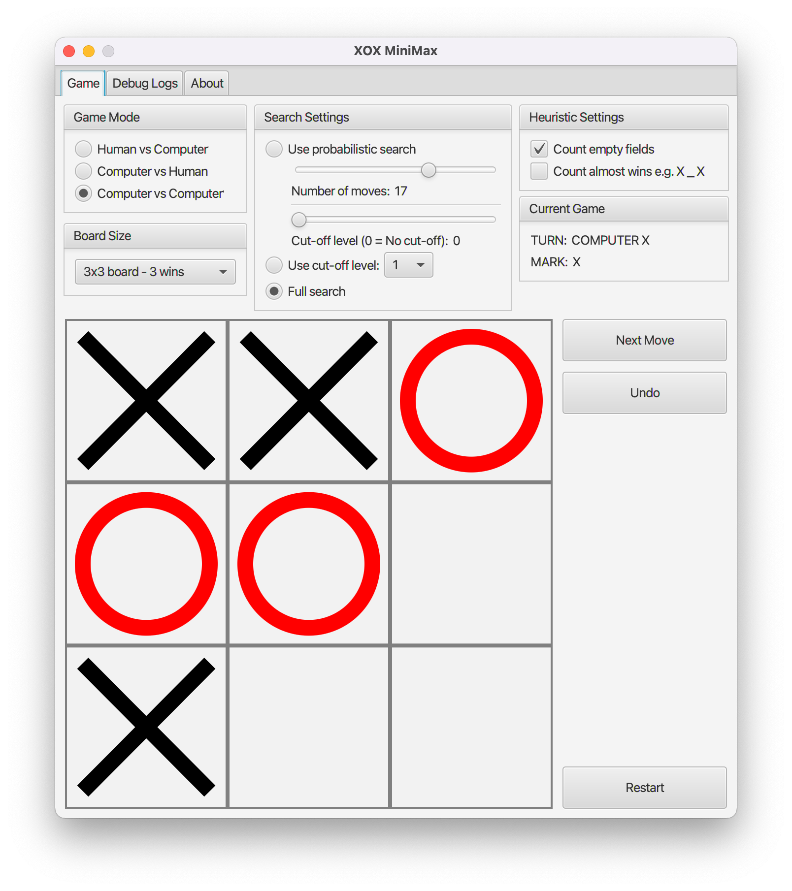

### TicTacToe minimax



To start execute:
```
./mvnw clean install
./mvnw javafx:run -pl gui
```

Application GUI was created using JavaFX.
I tested it on both macOS and Linux.

## Contributors Guide

### SceneBuilder setup

0. Make sure to upgrade to SceneBuilder 17.0

   
1. Create a JAR with `GameBoard` custom control
```
./mvnw clean package
```
This will create `gui/target/gui-1.0.0-SNAPSHOT.jar` file.

2. Import JAR into SceneBuilder

Open JAR/FXML Manager:


Select "Add Library/FXML from file system" option and select
`gui/target/gui-1.0.0-SNAPSHOT.jar` file.

Select only `GameBoard` control:


If `GameBoard` does not show up on the list,
you need to check SceneBuilder version.
You have to use SceneBuilder compatible with JDK and JavaFX versions
used in the project.

3. Now you should be able to open `MainWindow.fxml` in SceneBuilder

